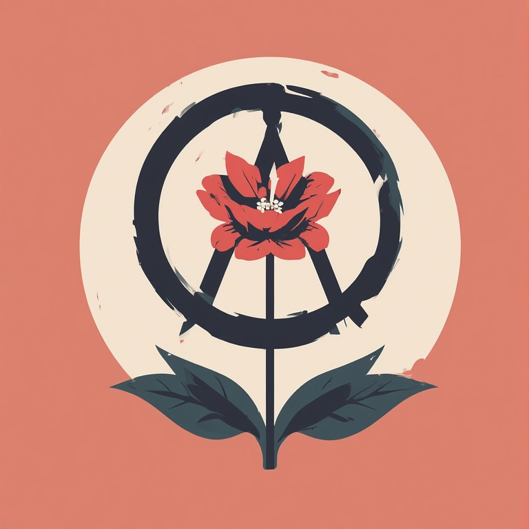
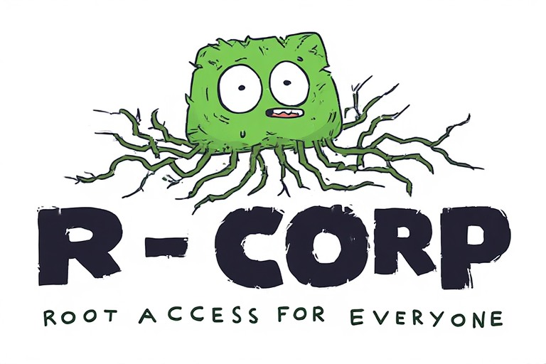

# decensorweb

<p align="center">
  
</p>

[](https://github.com/sponsors/RR-Ralefaso)

**decensorweb** is a social media platform dedicated to upholding freedom of speech by removing government-mandated censorship. This project was born from the direct need for a space where individuals can criticize their governments and discuss political reality without fear of being silenced or banned.

---

## 🚀 The Mission

* **Anti-Censorship:** Built specifically to counter the increasing amount of government-driven suppression found on mainstream platforms.
* **Political Accountability:** A dedicated space for users to voice concerns and critiques regarding their leadership.
* **Always Free:** This is a free platform for the people, by the people.

## 🎯 Our Aim

* **Safety First:** Create a secure environment for global communication.
* **Unfiltered Thought:** Empower users to share their thoughts and experiences freely.
* **Zero Hate Speech:** We strictly distinguish between political dissent and hate speech. **We do not promote or host hate speech.**

---

## 🛠 Getting Started (For Developers)

We welcome developers who believe in an open internet. To start contributing:

1. **Clone the Repo:**

    ```bash
    git clone [https://github.com/RR-Ralefaso/decensorweb.git](https://github.com/RR-Ralefaso/decensorweb.git)
    ```

2. **WORK** 

---

## 🤝 How to Support

### 1. Sponsor the Project

Maintaining a free, independent platform requires resources. You can help keep our servers running and our code open by sponsoring the project here:
👉 **[Sponsor RR-Ralefaso on GitHub](https://github.com/sponsors/RR-Ralefaso)**

### 2. Collaborate

If you are a developer, security researcher, or UI/UX designer, we would love to have you on board. Check out our `CONTRIBUTING.md` (coming soon) or open an issue to get started.

---

## 📜 License

This project is open-source. Please check the `LICENSE` file for more details.

---

<p align="center">
  <b>Created and Maintained by</b><br>
  <br>
  <i>Empowering digital freedom.</i>
</p>
